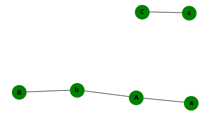
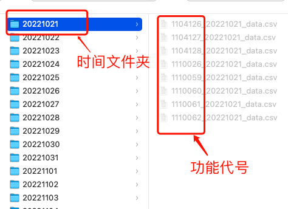

<!--https://www.miniits.com/logo.html-->


<!-- 

-->

## 简单，快捷的AI模型训练和语料处理小工具集合～


### 一，语料冲突检测工具

#### 1, 什么是语料冲突?

* 在很多情况下，语料来源是多样的。尤其在NLP领域，可能引入***样本内容相同，但是标签却不同***的情况，如果存在这样的冲突语料将会导致模型很难收敛。


#### 2, 快速使用：


* 下载：
	* 必须下载1.4.6版本以上才有语料检测功能!

```shell
pip install pyaitools==1.4.6
```

```shell
pip install pyaitools==1.4.6 -i https://pypi.org/simple/
```


* 使用：

```python
from pyaitools import detect

# 需要进行检测的训练数据路径
sample_path = "./train.csv"

# 检测完后需要写入的新文件路径
deconflict_sample_path = "./new_train.csv"

detect.corpus_conflict_detect(sample_path, deconflict_sample_path)
```


> * 输出：

```text
去重后Y标签数量: 3
去重后N标签数量: 3
去重后冲突样本数量:2
冲突样本已写入路径:./conflict_sample.txt
去冲突+去重复后Y标签数量: 1
去冲突+去重复后N标签数量: 3
```


* 参数：
> * sample_path: 需要检测的训练数据路径，训练数据格式为csv，详细要求看下面介绍，无默认值，必须写
> * deconflict_sample_path: 去除冲突后，新训练数据的路径, 无默认值，必须写
> * sep: 需要检测的csv文件中使用什么作为分隔符, 默认为",", 也可以选择"\t"
> * label_list: 标签列表，该列表只有两个元素，默认为["Y", "N"]，需要按照自己定义的标签进行修改
> * choiceDeleteLabel: 当样本发生冲突时，选择删除哪一类标签后生成新数据，默认为"Y"，需要按照自己定义的标签进行修改
> * csample_path: 冲突数据写入的文件路径，默认为./conflict_sample.txt


* 训练数据格式要求：


> * 训练数据例子：
```csv
sentence1,sentence2,relation
镀锌钢管水冲洗调和漆一道,镀锌钢管室内水dn50,N
镀锌钢管水冲洗调和漆一道,镀锌钢管国标螺纹连接水压试验,Y
镀锌钢管,镀锌钢管室内水dn50,N
镀锌钢管室内水dn50螺纹连接水压试验,镀锌钢管螺纹连接水压试验,N
镀锌钢管,镀锌钢管室内水dn50,Y
镀锌钢管水冲洗调和漆一道,镀锌钢管室内水dn50,Y
```

> * 1，训练数据由内容列+标签列构成，其中内容列可以是任意多列（例子中是两列sent1和sent2）
> * 2，标签列必须是最后一列，而且该检测只针对二分类，标签必须只有两种
> * 3，内容列+标签列的列名随意

---

### 二，通过文本相似关系进行聚类


#### 1, 背景

* 对于任意多段文本，已知他们之间所有相似关系（是否相似），希望输出具有相似关系的N个类，N由具体相似关系决定；假设我们只有三条文本A，B，C，其中只有A，B是相似的，那么输出则为[{A, B}, {C}]两个类，若不止A，B是相似的，A，C也是相似的，那么输出为[{A, B, C}]只有一个类。


#### 2, 快速使用：

* 下载：
	* 必须下载1.4.8版本以上才有该功能!

```shell
pip install pyaitools==1.4.8
```


* 使用：

```python
from pyaitools import similar

# 任意一组文本
input_list = ["A","B","C","A"]
# 与input_list具有1vs1相似关系的文本
# 如："A"与"a"是相似的，"B"与"b"是相似的等等
similar_input_list = ["a","b","c","b"]
c_list = similar.find_connected_area(input_list, similar_input_list)
print(c_list)
```


> * 输出：

```text
[{'a', 'A', 'b', 'B'}, {'c', 'C'}]
```



* 参数：
> * input_list: 必须写, 文本组成的列表，相似文本对的一部分
> * similar_input_list: 必须写, 文本组成的列表，相似文本对的另外一部分
> * connected_area_min_num: 输出连通区域（集合）中最少的文本数量，为了避免输出内容过多，可以通过该参数进行过滤，少于该数字的集合将不会输出，默认为0

---


### 三，AI服务的线上埋点数据反馈


#### 1, 背景：

* 当你的AI服务上线之后，真实用户开始请求他们来完成工作，我们希望整个使用流程对AI工程师是透明的，并且准确记录用户使用过程中的修改行为（因为用户进行修改大概率意味着你推荐的内容存在问题），这里的数据能够帮助我们发现真实用户使用过程中的问题，获取比线下指标更加具有代表性的线上指标，最终也会成为更有力的优化途径。

#### 2, 该怎么做？

我们把这个流程总结为以下几步，为了最终能够复用我们的工具，我们还希望遵循一些统一的规则：

* Step1: 记录数据
> * 通过埋点的方式，记录每天AI功能被触发时的相关数据
> * 第一层为每天的时间（文件夹）
> * 第二层为包括"功能代号"的csv文件（文件）
> * csv文件包括触发时的具体内容，至少包括：
>> * 工程id（工程/任务的唯一标识）
>> * 分母数（假如用户修改一次，那么你需要用这个1除以谁，才能够计算修改率）
>> * 原始内容
>> * 推荐内容
>> * 修改内容




* Step2: 计算修改率
> * 对于每一个功能的埋点表（一张表）来讲，我们通过埋点名解析对应功能的修改率
> * 首先获取工程粒度的修改表：
>> * 聚合当前工程id
>> * 计算该工程总修改数：工程id出现的次数=用户对该工程的修改次数（每次埋点触发）
>> * 实际修改数 = 总修改数 - 误修改数
>> * 误修改数：是指虽然做了修改操作但实际上并不需要修改的情况出现的次数
>> * 计算分母数：分母数的计算不同项目之间可能存在差异，这里默认取最大值
>> * 当日实际修改率：当日所有工程实际修改数之和 / 当日所有分母数之和
>> * 实际修改率：每日实际修改数之和 / 每日分母数之和

* Step3: 获取修改数据进行badcase分析


#### 3, 快速使用

* 下载：
	* 必须下载1.4.10版本以上才有该功能!

```shell
pip install pyaitools==1.4.10
```


* 使用：
	* 在pyaitools/feedback/是示例文件夹，里面有一组数据可以用来实验！


```python
from pyaitools import feedback

# 埋点数据文件夹
ori_path = "./feedback/"
# 埋点功能代号列表
buried_point_number_list = ["1104127", "1104128"]
# 理论上存在一些不可以为空的列，一旦他们的值为空，说明数据存在一定的问题
# 为了避免影响计算，在这里可以删除其为空的所在行内容
non_empty_column = ["projectid", "curdescription"]
# 埋点表中每一行代表一次修改，需要将这些修改聚合到各自的工程上，所以每条数据需要工程id进行辨识
projectID = "projectid"
# 修改率的分母列
xlbqnumber = "xlbqnumber"
# 内容间隔标志
content_interval_mark = "@"
# 原始内容相关的列
origin_content_columns = ["curdescription", "curspec"]
# 推荐内容相关的列
recommend_content_columns = ["matcheddescription", "matchedspec"]
# 修改内容相关的列
modify_content_columns = ["matchdescription", "matchspec"]

# 因为推荐内容不一定存在，埋点中可能缺失对应的列，需要指定内容标识
recommend_content_substitute = "error"
(
    modify_content,
    modification_rate,
    pid_num,
    total_number,
    error_number,
    max_num,
) = feedback.get_modification_rate_and_content(
    ori_path,
    buried_point_number_list,
    projectID,
    xlbqnumber,
    origin_content_columns,
    recommend_content_columns,
    modify_content_columns,
    non_empty_column,
    content_interval_mark,
    recommend_content_substitute,
)
print(f"修改内容:{modify_content}")
print(f"实际修改率:{modification_rate}")
print(f"触发工程数: {pid_num}")
print(f"总修改数:{total_number}")
print(f"误修改数:{error_number}")
print(f"分母数:{max_num}")
```

> * 输出：

```text
修改内容:[['混凝土垫层@商品砼C15；混凝土坍落度、石子粒径、运距、泵送高度、距离、泵送方式综合', '混凝土垫层@商品砼C15；混凝土坍落度、石子粒径、运距、泵送高度、距离、泵送方式综合', '混凝土垫层@商品砼C15；混凝土坍落度、石子粒径、运距、泵送高度、距离、泵送方式综合']]
修改率:0.0
触发工程数: 1
总修改数:1
误修改数:1
最大分母数:3248
```

* 参数：
> * ori_path: 必须写，埋点数据文件夹
> * buried_point_number_list: 必须写，埋点功能代号列表，程序将解析其中带有该代号的csv文件，一同计算修改率
> * projectID: 必须写，工程/任务的唯一标识
> * xlbqnumber: 必须写，分母数，本次修改率计算的分母
> * origin_content_columns: 必须写，原始内容的相关列
> * recommend_content_columns: 必须写，推荐内容的相关列
> * modify_content_columns: 必须写，修改内容的相关列
> * non_empty_column: 一定不可以为空值的列，若出现空值则删除改行，默认为[]
> * content_interval_mark: 若内容为多个列时，文本使用该标识进行分割，默认为"@"
> * recommend_content_substitute: 因为推荐内容不一定存在，埋点中可能缺失对应的列，需要指定内容标识，默认为"error"

---
